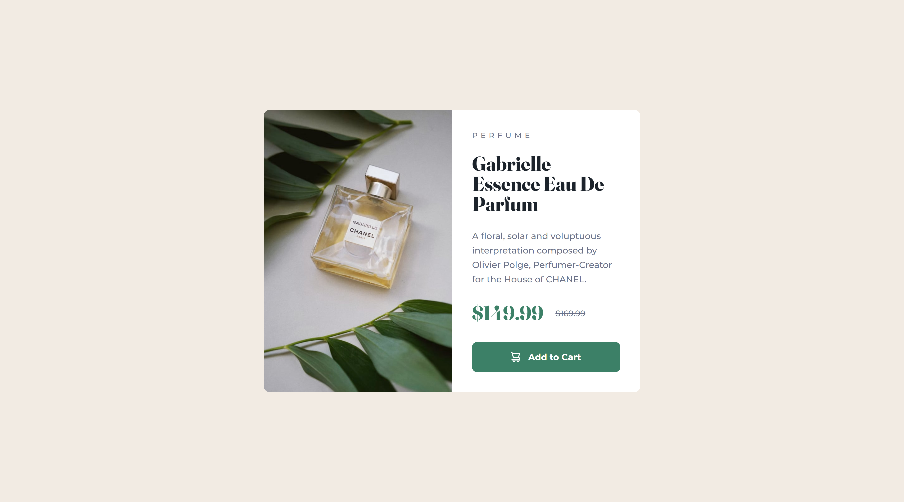

# Frontend Mentor - Product preview card component solution

This is a solution to the [Product preview card component challenge on Frontend Mentor](https://www.frontendmentor.io/challenges/product-preview-card-component-GO7UmttRfa). Frontend Mentor challenges help you improve your coding skills by building realistic projects. 

## Table of contents

- [Overview](#overview)
  - [The challenge](#the-challenge)
  - [Screenshot](#screenshot)
  - [Links](#links)
- [My process](#my-process)
  - [Built with](#built-with)
  - [What I learned](#what-i-learned)
  - [Useful resources](#useful-resources)

## Overview

### The challenge

Users should be able to:

- View the optimal layout depending on their device's screen size
- See hover and focus states for interactive elements

### Screenshot

Desktop:

Mobile:

### Links

- Live site: [Add live site URL here](https://your-live-site-url.com)
- Challenge solution: [Add solution URL here](https://your-solution-url.com)

## My process

### Built with

- Vue
- SCSS
- CSS custom properties
- Semantic HTML5 markup
- Flexbox
- CSS Grid
- Mobile-first workflow

### What I learned

I learned how to make the card responsive by switching between a column and row layout.

### Useful resources

- [Get your stylesheets more organized with Sass partials - YouTube](https://www.youtube.com/watch?v=9Ld-aOKsEDk) - My SCSS folder structure is inspired by this video.
